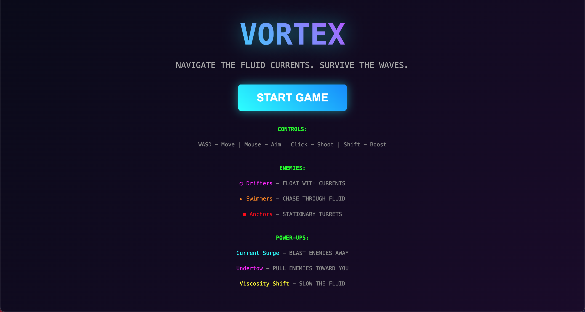
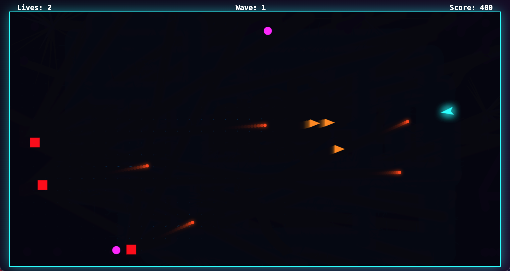
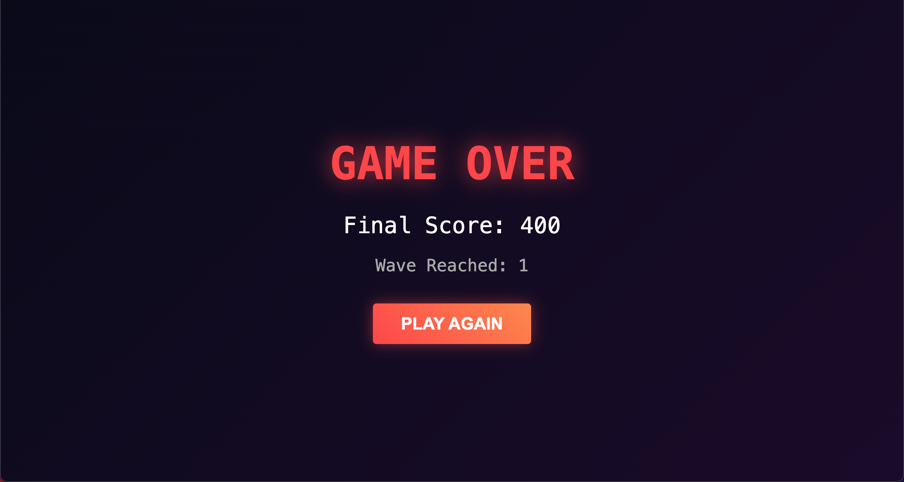

# Vortex

## Project Description

Vortex is a twin-stick shooter game that integrates a real-time fluid dynamics simulation based on the **Navier-Stokes equations**, allowing players to navigate and manipulate chaotic currents while battling escalating waves of enemies. Developed using Electron for cross-platform desktop deployment and React for efficient state management, the game's core FluidSimulator class provides a grid-based implementation of incompressible fluid mechanics, influencing the movement of the player, projectiles, enemies, and particles for a dynamic and unpredictable gameplay experience. This Navier-Stokes-driven twist sets Vortex apart from traditional shooters by turning the environment into an active participant in combat strategy—currents can aid in evasion, trap foes, or disrupt trajectories. As an exploration of AI's potential as a game developer, this project emerged from a vibe coding session, emphasizing creative prototyping and the fusion of computational physics with arcade-style action.

## Table of Contents

- [Installation](#installation)
- [Usage](#usage)
- [Features](#features)
- [Methodology](#methodology)
- [Results](#results)
- [References](#references)
- [Dependencies](#dependencies)
- [Algorithms/Mathematical Concepts Used](#algorithmsmathematical-concepts-used)
- [License](#license)
- [Acknowledgments](#acknowledgments)
- [Note](#note)

---

## Installation

1. Install Node.js and npm if not already installed. Download from [Node.js official website](https://nodejs.org/).

2. Create a project directory:
```bash
mkdir vortex-game
cd vortex-game
```

3. Download the **all** project files ((`game.js`, `main.js`, `package.json`, `index.html`) from the current repository and place them into the directory- *vortex-game*.
4. Launch the terminal from the directory.
5. Run the command ```npm install``` to install the dependencies.
6. Run the command ```npm start``` to launch the electron app and play the game.
7. To build the game for specific platforms:
   - Windows: `npm run build-win`
   - macOS: `npm run build-mac`
   - Linux: `npm run build-linux`

## Usage

### Playing the Game

1. Controls:
   - WASD: Move the player with fluid-influenced dynamics
   - Mouse: Aim direction for shooting
   - Left Click: Fire projectiles that interact with currents
   - Shift: Boost speed, adding velocity to the fluid simulation

2. Objective: Survive increasingly difficult waves by leveraging the Navier-Stokes simulated currents to outmaneuver enemies. Defeat foes to spawn power-ups that alter fluid properties, and aim for high scores across endless waves.

## Features

- **Navier-Stokes Fluid Simulation**: Real-time, grid-based incompressible fluid dynamics affecting all entity movements for emergent gameplay
- **Twin-Stick Shooter Mechanics**: Independent keyboard movement and mouse aiming with boost functionality
- **Diverse Enemy Types**: Drifters that passively follow currents, Swimmers that actively pursue through fluid resistance, and Anchors as fixed turrets firing projectiles
- **Power-Up System**: Collectibles like Current Surge (radial push via velocity addition), Undertow (pull towards player), and Viscosity Shift (temporarily increase fluid viscosity to slow everything)
- **Particle and Visual Effects**: Dynamic particles for boosts, explosions, and shots; semi-transparent trails and glowing neon aesthetics
- **Progressive Waves**: Timed enemy spawns that scale with wave number, mixing types for varied challenges
- **HUD and Menus**: React-rendered overlays for scores, lives, and waves; stylish menu and game over screens with gradients and shadows
- **Performance Optimizations**: Refs for mutable state, 60 FPS loop, and efficient canvas rendering

## Methodology

### 1. Project Structure and Electron Setup

- `main.js`: Handles Electron window creation (1280x720, non-resizable), loads `index.html`, and manages app lifecycle without Node integration for security.
- `index.html`: Sets up the HTML scaffold, loads React/Babel via CDNs, applies full-screen styling, and includes `game.js` as a Babel script.
- `game.js`: Core React component `VortexGame` encapsulating all logic, from state hooks to the FluidSimulator integration.
- `package.json`: Defines scripts for starting and building, with dependencies for Electron and builder.

### 2. Game Loop and State Management

- Utilizes `setInterval` at 60 FPS via `useEffect` for the main loop, updating simulation and rendering only in "playing" state.
- React `useState` for high-level states (gameState, score, wave, lives); `useRef` for performant mutable entities (player, projectiles, enemies, particles, powerUps, fluid).
- State transitions: Menu initializes with instructions; playing runs loop; gameover displays stats and restart.

### 3. FluidSimulator Class and Navier-Stokes Integration

- The `FluidSimulator` is a self-contained class simulating a 48x48 grid of velocity fields using finite difference methods for diffusion, projection, and advection.
- Integration: Instantiated once, stepped each frame; entities query velocities via bilinear interpolation and add forces (e.g., player movement injects velocity).
- This creates realistic current behaviors, where actions like boosting propagate waves affecting distant entities.

### 4. Entity Systems and Mechanics

- **Player**: Position updated with key inputs, fluid drag, and bounds; angle tracks mouse; shoots with cooldown.
- **Enemies**: Spawned at edges; behaviors differ by type—drifters drift with fluid, swimmers chase with fixed speed against currents, anchors shoot periodically.
- **Projectiles**: Velocity combined with fluid; friendly/enemy distinction for collisions.
- **Particles/Power-Ups**: Ephemeral visuals; power-ups apply global effects like velocity bursts or parameter tweaks.
- **Collisions**: Distance checks for hits, health reduction, and effects.

### 5. Input Handling and Rendering

- Event listeners in `useEffect` update refs for keys and mouse.
- Canvas pipeline: Semi-transparent clear for trails, draw velocity lines, then layered entities with shadows/rotations.

### 6. Wave Progression and Balancing

- Waves advance every 10 seconds, spawning scaled enemy counts; constants like speeds and sizes tunable at top of `game.js`.

## Results

### Game Performance and Testing

- Achieves stable 60 FPS on mid-range hardware, with fluid steps optimized via low iteration counts (4 for diffusion).
- Simulation realism: Currents create vortices and flows, tested for stability without divergence.
- Gameplay balance: Waves tested to escalation, with power-ups providing strategic depth.

### Visual Examples

| *Fluid Simulation in Action* |
|:--:|
|  |

| *Player Boosting Through Currents* |
|:--:|
|  |

| *Enemy Wave with Power-Ups* |
|:--:|
|  |

While twin-stick shooters like Shapefighter exist, Vortex's Navier-Stokes fluid mechanics add a physics-based layer absent in most, enabling current-based tactics.

## Dependencies

- electron>=28.0.0
- electron-builder>=24.9.1
- react@18 (via CDN)
- react-dom@18 (via CDN)
- @babel/standalone (via CDN)

## Algorithms/Mathematical Concepts Used

### 1. Navier-Stokes Equations for Fluid Simulation

- **Core Formulation**: Solves the incompressible Navier-Stokes momentum equation:
  
  $\frac{\partial \mathbf{u}}{\partial t} + (\mathbf{u} \cdot \nabla)\mathbf{u} = -\nabla p + \nu \nabla^2 \mathbf{u} + \mathbf{f}$
  
  with continuity $\nabla \cdot \mathbf{u} = 0$, discretized on a staggered grid.
- External forces $\mathbf{f}$ from entity interactions; viscosity $\nu$ and diffusion controlled by parameters.

### 2. Diffusion Step

- Viscosity solved via iterative Gauss-Seidel:

  $x[idx] = \dfrac{(x0[idx] + a \cdot (x[i+1] + x[i-1] + x[j+1] + x[j-1]))}{(1 + 4a)}$
  
  where $a = dt \cdot visc \cdot (size-2)^2$; 4 iterations for efficiency.

### 3. Projection Step

- Enforces divergence-free field by solving Poisson for pressure: $\nabla^2 p = \nabla \cdot \mathbf{u} / dt$ via relaxation, then subtract gradients: $u_x -= 0.5 \cdot (p_{i+1} - p_{i-1}) \cdot size$.

### 4. Advection Step

- Semi-Lagrangian back-tracing: $x' = x - dt \cdot u(x), y' = y - dt \cdot v(x)$ with bilinear interpolation for new velocities.

### 5. Boundary Handling

- No-slip: Tangential negation, e.g., $vx[0,j] = -vx[1,j]$ for horizontal.

### 6. Entity-Fluid Coupling

- Bilinear velocity lookup; additive forces scaled to grid.

## References

1. Stam, J. (2003). Real-Time Fluid Dynamics for Games. *Game Developers Conference*.
2. Bridson, R. (2008). *Fluid Simulation for Computer Graphics*. A K Peters/CRC Press.
3. Harris, M. J. (2004). Fast Fluid Dynamics Simulation on the GPU. *GPU Gems*.
4. Free Software Foundation. (2007). GNU Affero General Public License v3.0.

## License

This project is licensed under the GNU Affero General Public License v3.0 - see the [LICENSE](LICENSE) file for details.

## Acknowledgments

- Jos Stam for foundational fluid simulation techniques
- Electron and React teams for enabling rapid desktop prototyping
- xAI for initial code generation and analysis

## Note

| AI was used to generate the entire codebase and documentation in a single attempt. |
|:--:|
